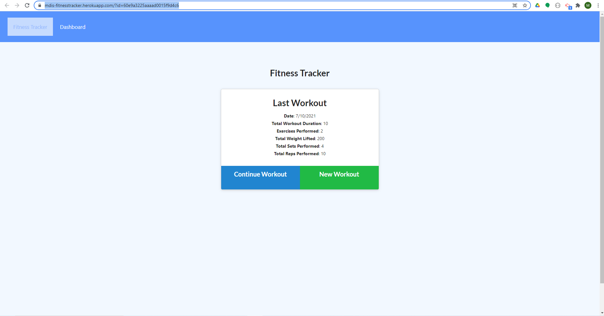
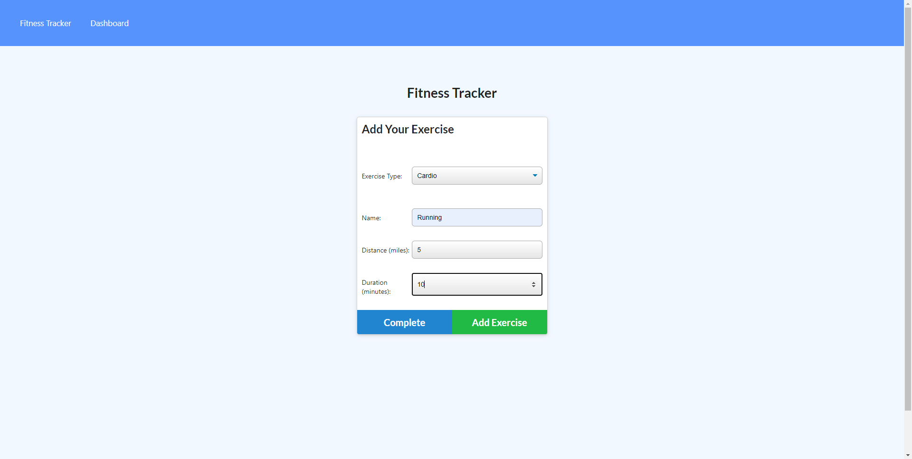
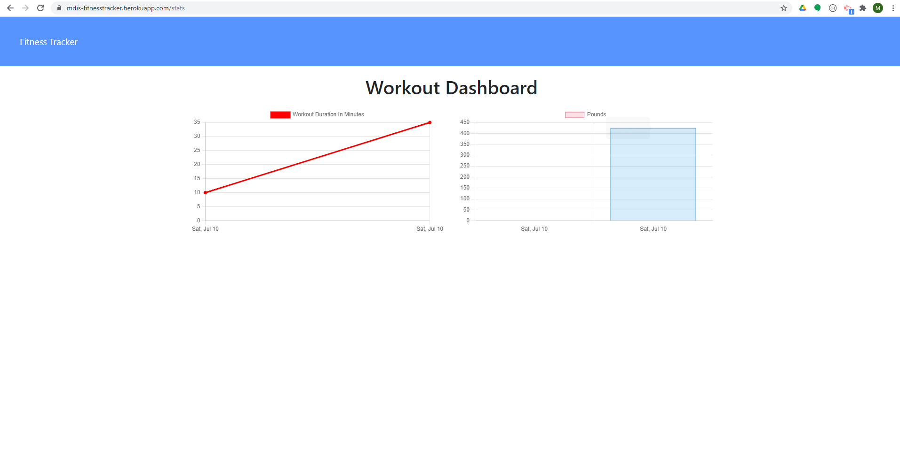

# NoSQL---Workout-Tracker-
https://github.com/mdis928/NoSQL---Workout-Tracker-

## Description
The goal for for this homework was to create and track mutiple exercises and storing that data using NoSQL. In this case, I used MongoDB. With that database, we used object-docuemnt mapping, mongoose.js, and CRUD

## Table of Contents
* [Installiation](#installiation)
* [Usage](#usage)
* [License](#license)
* [Contributions](#contributions)
* [Tests](#tests)
* [Questions](#questions)

## Installiations 
MongoDB, express, mongoose, morgan, Heroku

## Usage
Sever.js, routes folder, and models folder needed to be created and coded. 

In the models folder, we have a workout.js which creates the schema for the data. We have the day, type of exercise, name, duration, weight, reps, sets, and distance. 

In routes folder, take a look at api.js, here we have our routes that map to our .html pages plus our CRUD operations. 

In the sever.js file, code here connects all dependencies including mongoose.connect (lines 13-18). Those lines are very important as that connects us to MongoDB.

## License
This project is licensed under: []

## Contributing
Contributors: Michael DiSanto

## Test
To test the code, either use the URL of the deployed app, or take the code, install dependencies, and connect to local host. You will see that the app will look and store all your workouts.

## Questions
If you have any questions about the repo, contact Michael DiSanto at mdis928 via github or mdisanto928@gmail.com via email

## Links
https://mdis-fitnesstracker.herokuapp.com/?id=60e9a3225aaaad0015f9d4c6
https://github.com/mdis928/NoSQL---Workout-Tracker-

